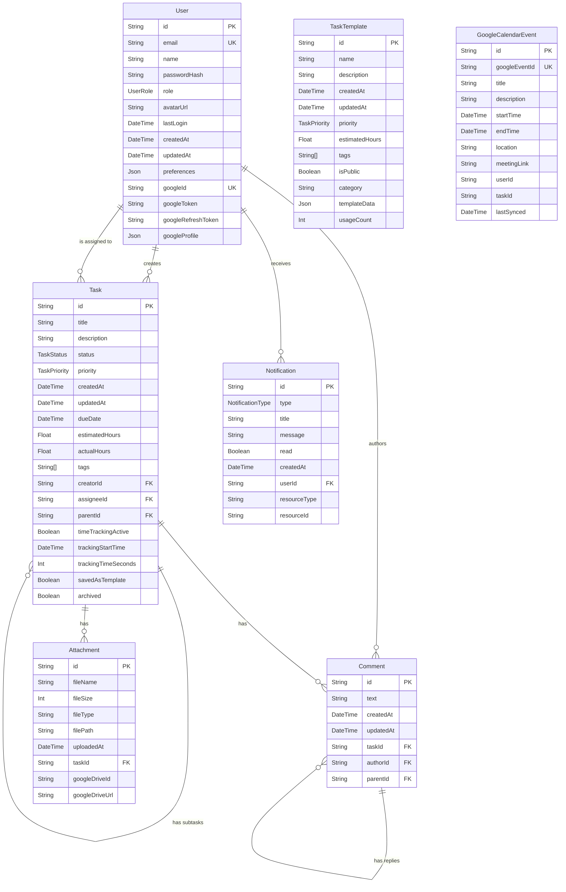

# Entity-Relationship Diagram (ERD) for Track-It

## Overview

This document provides a comprehensive view of the database structure for Track-It, based on the Prisma schema.

## ER Diagram

## Entity Relationships

### User
- **Creates Tasks**: One user can create many tasks (`createdTasks` relation)
- **Is Assigned Tasks**: One user can be assigned many tasks (`assignedTasks` relation)
- **Authors Comments**: One user can author many comments
- **Receives Notifications**: One user can receive many notifications

### Task
- **Created By User**: Each task is created by one user
- **Assigned To User**: Each task may be assigned to one user (optional)
- **Parent-Child Relationship**: Tasks can have subtasks (self-referencing relationship)
- **Has Comments**: One task can have many comments
- **Has Attachments**: One task can have many attachments

### Comment
- **Belongs to Task**: Each comment belongs to one task
- **Authored by User**: Each comment is authored by one user
- **Parent-Child Relationship**: Comments can have replies (self-referencing relationship)

### Attachment
- **Belongs to Task**: Each attachment belongs to one task

### Notification
- **Belongs to User**: Each notification belongs to one user

### TaskTemplate
- Standalone entity for task templates

### GoogleCalendarEvent
- Represents synced calendar events that may be linked to tasks

## Enum Types

- **UserRole**: ADMIN, MEMBER, GUEST
- **TaskStatus**: BACKLOG, TODO, IN_PROGRESS, REVIEW, DONE, ARCHIVED
- **TaskPriority**: LOW, MEDIUM, HIGH, URGENT
- **NotificationType**: TASK_ASSIGNED, TASK_UPDATED, COMMENT_ADDED, DUE_DATE_REMINDER, MENTION, SYSTEM

## Key Features

1. **Self-referencing relationships** for task hierarchies and comment threads
2. **Google integration** with fields for Google authentication and Drive/Calendar integration
3. **JSON fields** for flexible storage of preferences and template data
4. **Time tracking** capabilities with active status and duration tracking
5. **Comprehensive metadata** including creation/update timestamps, file information, etc.