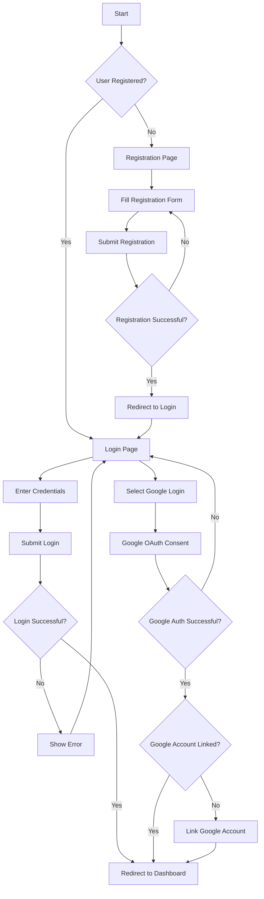
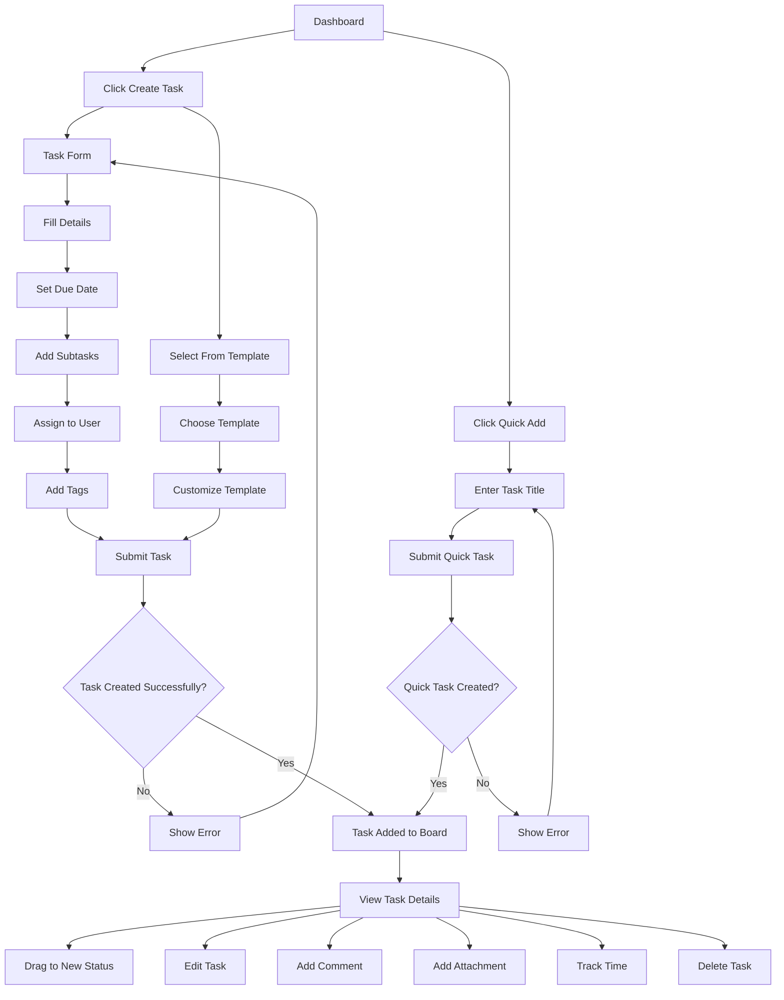
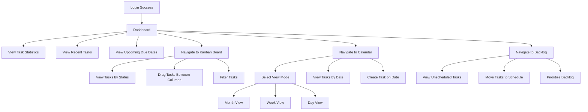
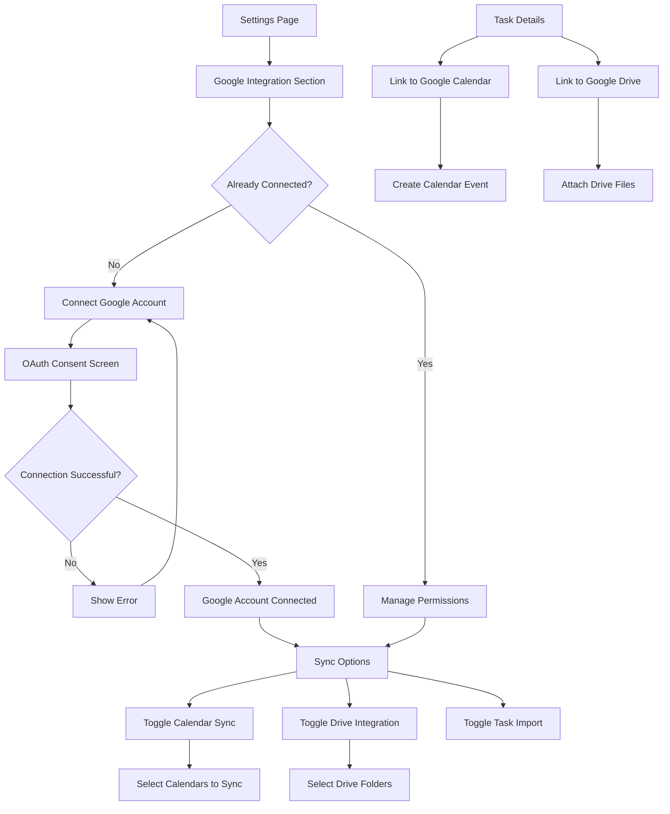
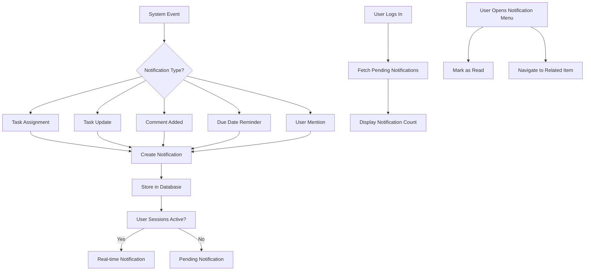
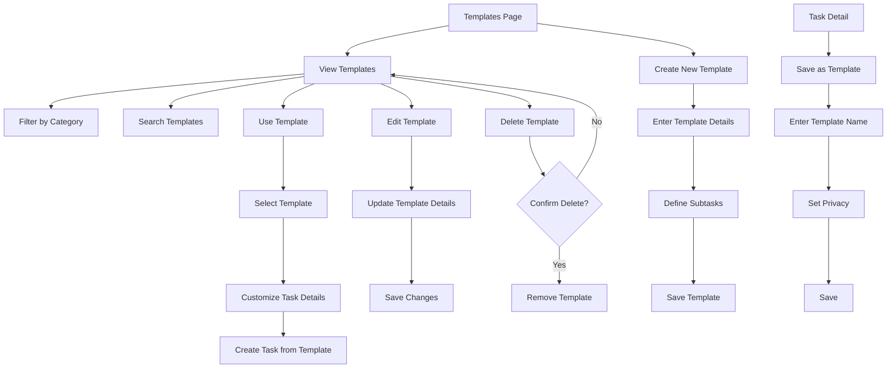
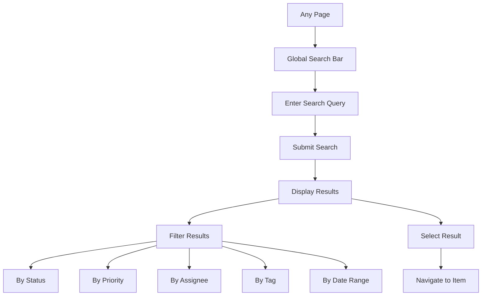
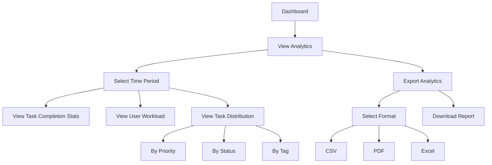

# Track-It User Flows

This document outlines the primary user flows within the Track-It application.

## 1. Authentication Flow

## 2. Task Creation and Management Flow

## 3. Dashboard and Views Navigation Flow

## 4. Google Integration Flow

## 5. Notification Flow

## 6. Template Management Flow

## 7. Search and Filter Flow

## 8. Analytics Flow

